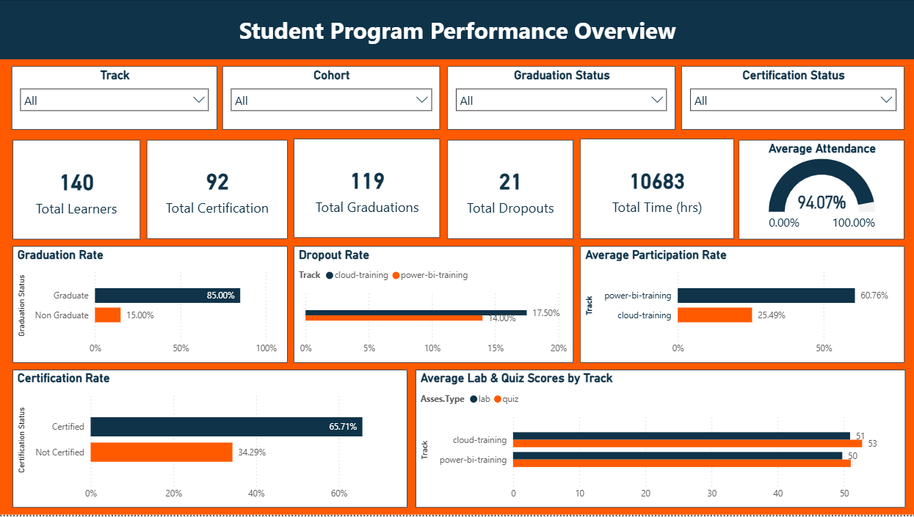
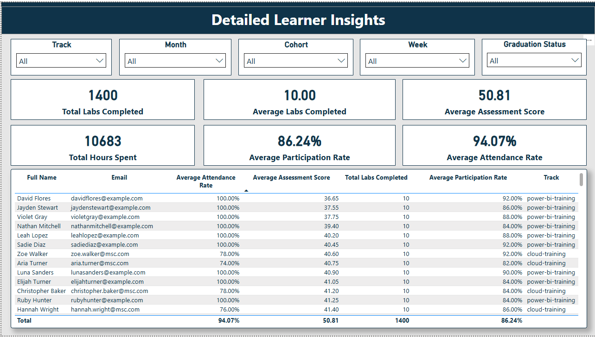
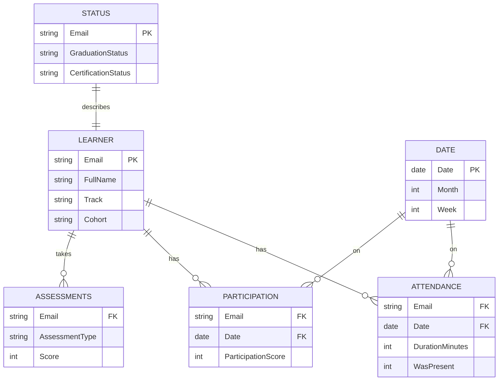

# Power BI Dashboard: Dare Careers Student Progress Tracking

This project is a comprehensive Power BI dashboard designed to monitor and analyze student performance, attendance, and outcomes for Dare Careers' **Power BI** and **AWS Cloud** training programs.

## Project Objective
To provide Program Managers and Trainers with actionable insights into:
*   **Overall Program Health:** Graduation, Certification, and Dropout rates.
*   **Student Engagement:** Daily attendance and participation trends.
*   **Individual Performance:** Detailed tracking of Labs, Quizzes, and At-Risk students.

---

## Dashboard Structure

The report is divided into two strategic pages:

### Page 1: Student Program Performance Overview
*A high-level executive summary for stakeholders.*
*   **Key Metrics:** Total Learners, Certifications, Graduations, Dropouts, and Total Learning Hours.
*   **Visuals:**
    *   **Bar Charts:** Graduation & Certification Rates by Cohort.
    *   **Breakdowns:** Dropout Rates by Track & Assessment Scores (Lab vs Quiz).
    *   **Engagement:** Average Participation trends.
*   **Slicers:** Track, Cohort, Graduation Status, Certification Status.



### Page 2: Detailed Learner Insights
*A granular view for trainers to monitor individual progress.*
*   **Learner Table:** A detailed list of every student with their Email, Status, Attendance %, and Assessment Scores.
*   **KPI Cards:** Average Attendance Rate, Participation Rate, Labs Completed, and Hours Spent.
*   **Deep Dive Slicers:** Week-by-Week and Month-by-Month filtering.



---

## Technical Implementation & Challenges

During development, we encountered and solved several key technical challenges:

### 1. Data Cleaning & Type Mismatches
*   **Challenge:** The `was-present` column in the Attendance table was initially read as a **Text/String** format, causing aggregation errors.
*   **Solution:** We forced the data type to **Whole Number** in Power Query to ensure accurate `SUM` and `AVERAGE` calculations.

### 2. Complex Attendance Logic
*   **Challenge:** Calculating "Attendance Rate" wasn't as simple as counting rows. We had to account for the **total possible sessions** vs. **actual attended sessions**.
*   **Solution:** We used advanced DAX to dynamically calculate the denominator:
    ```dax
    Total Scheduled Sessions = DISTINCTCOUNT('Combine-Learner-Zoom-Attendance'[date]) * COUNTROWS('Learner')
    ```
    This ensured that even if a student was absent (no row), the rate calculation remained accurate.

### 3. Handling "Blank" Values
*   **Challenge:** When filtering by specific weeks or tracks, some cards would return `(Blank)`.
*   **Solution:** We wrapped robust `IF(ISBLANK(...), 0, ...)` logic around measures like `Total Hours Spent` and `Average Attendance Rate` to ensure a clean "0" is displayed instead of confusing blanks.

### 4. Participation "Rate" vs "Days"
*   **Decision:** Originally, we looked at "Average Participation Days". However, to standardize comparison across cohorts of different lengths, we switched to **"Average Participation Rate (%)"**:
    ```dax
    Average Participation Rate = DIVIDE([Total Participation Days], [Total Expected Participation Days], 0)
    ```

---

## 📈 Data Model (Constellation Schema)

The project utilizes a **Constellation Schema** where multiple Fact tables share common Dimensions.



---

## Information Design (UI/UX)
We adopted a **Professional Corporate Theme** to ensure readability and executive appeal.
*   **Color Palette:** Deep Navy (`#002050`) for headers, Bright Blue (`#0078D4`) for data, and Light Grey (`#F3F2F1`) for the canvas background.
*   **Layout:**
    *   **Card Design:** White cards with 10px rounded corners and subtle drop shadows for depth.
    *   **Navigation:** Slicers converted to **Dropdowns** to save canvas space and reduce clutter.
    *   **Consistency:** Identical header positioning and card sizing across both pages.

## How to Use
1.  **Filter First:** Use the top Slicers (Track/Cohort) to narrow down the view.
2.  **Identify Trends:** On Page 1, look for Tracks with high Dropout rates or low Assessment scores.
3.  **Drill Down:** Switch to Page 2 and use the **Learner List** to find specific students contributing to those trends (e.g., students with <80% Attendance).